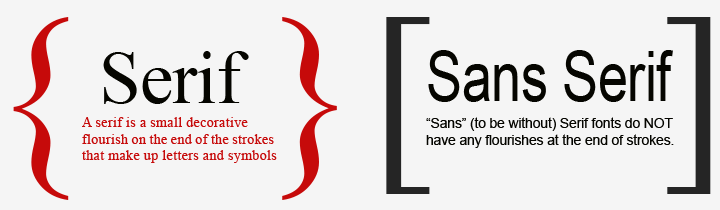

# FEWD 23 Lesson 4

## Layout

---

## Agenda

* Class vs. ID review
* HTML5 Structural Elements
* Floats
* Google Fonts
* Lab Time

Note:
Learning Objectives
- Draw the DOM Tree for web pages containing ```<div>``` & ```<section>```.
- Apply header, footer, sidebar, and multi-column layouts to develop a web page.
- Experiment and predict effects of floats and clearing CSS positioning.

---

## But first!... a scheduling note

Note:
http://updwn.co/-KDYwcA_Q2M2lu0-jX9y

---

## Review

We went through a whole lot of stuff on Tuesday, so let's review.

Note:
To Dos:
- Sync class repo!
- What is the box model?

---

## Class vs. ID

Let's review!  What's the difference?

Note:
- IDs are unique.  Only 1 per page.
- Classes are not unique.  Can have many on a page.

---

## Class vs. ID

When should you use them?

Note:
Go over best practices here!
- classes great for styles that will be reused.
- you want to reuse styles for consistency. 
- you also don't want to write a ton of code; more to maintain
- ids are great for very unique styles; usually only use ids for JS, though (later!)

---


## Class vs. ID

---

## HTML5 Structural Elements

Adding structure to HTML elements that are related to content layout.

* header
* aside
* footer
* nav

Note: 
Pull up an article page.  Create a quick DOM tree on the board as an everyone-do exercise.
[ http://www.cct.org/2015/12/teens-with-down-syndrome-find-their-voice-on-stage/ ]

---

## Floats

Float is a CSS positioning property, used to layout a web page. 


Note:
Image from Chris Coyier's CSS-Tricks

---

## Floats

```
.myFloatingBlock {
	float: left;
	width: 20%;
}
```

---


## Layout Challenge

Note:
First 2 do as a group; rest have them pair up.

---

## Let's talk about fonts

All computers come with a set of standard fonts.  These are called _web-safe fonts_.

* Arial
* Georgia
* Times New Roman
* Verdana
* ... even Comic Sans

Note:
http://www.w3schools.com/cssref/css_websafe_fonts.asp

---

## Fonts

```
body {
    font-family: Arial, Verdana, sans-serif;
}
```

---

## Serif vs. Sans-Serif



---

## Serif vs. Sans-Serif


---

## What if I want a different font?

Google Fonts!!

Note:
https://www.google.com/fonts

---


## Lab Time
