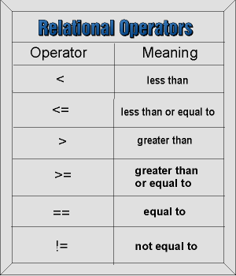
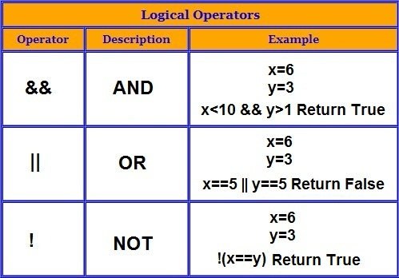

# FEWD 23 Lesson 10

## Conditionals & Functions

---

## Agenda

* Review
* Conditionals, part 2!
* Functions
* Lab

---

## Conditionals

```
if (condition is true) {
    // Do cool stuff
} else {
    // Do other cool stuff
}
```

---

## Conditionals - you can have lots!

```
var topic = "JS";

if (topic == "JS") {
    console.log("You're learning JavaScript");
} else if (topic == "JavaScript") {
    console.log("You're still learning JavaScript");
} else {
    console.log("You're learning something else");
}
```

---

## Logical Operators



---

## More Logical Operators



---

## Back to that other conditional

```
var topic = "JS";

if (topic == "JS" || topic == "JavaScript") {
    console.log("You're learning JavaScript");
} else {
    console.log("You're learning something else");
}
```

---


## Compare That

Note:
Starter code is in lesson 9 folder.

---

## Before moving on... 1 more jQuery function

What if I want to change the background color based on how my numbers compare?

---

## addClass

In my Javascript:

```
$('body').addClass('purple');
```

Meanwhile, in my CSS:

```
.purple {
    background-color: purple;
}
```

---

## Functions

__Functions__ are chunks of code that accomplish a specific task.

---

## Functions Syntax


---

## Function Calls


---

## Function Arguments


---

## Function Arguments


---

## Function Returns

```
function addThings(val1, val2) {
    var sum = val1 + val2;
    return sum;
}

var newNumber = addThings(1, 2);  // newNumber = 3
```

---


## Cash Register

---

## Anonymous Functions

Functions with no name.

---

## Anonymous Functions

```
$('a.readMore').click(function() {
    // Do stuff here
});
```

---

## Remember document.ready?

That is an anonymous function!

```
$(document).ready(function() {
    // All the jQuery goes here!
});
```

---


## Anonymous Cash Register

---

## Lab!

... But first, how do I start a project from scratch, on my own.?

---

## Solving a new problem

1. Figure out our goal.
2. Write pseudo-code.
3. Write the HTML.
4. Write the Javascript.
5. Write the CSS.

---


## Temperature Converter

